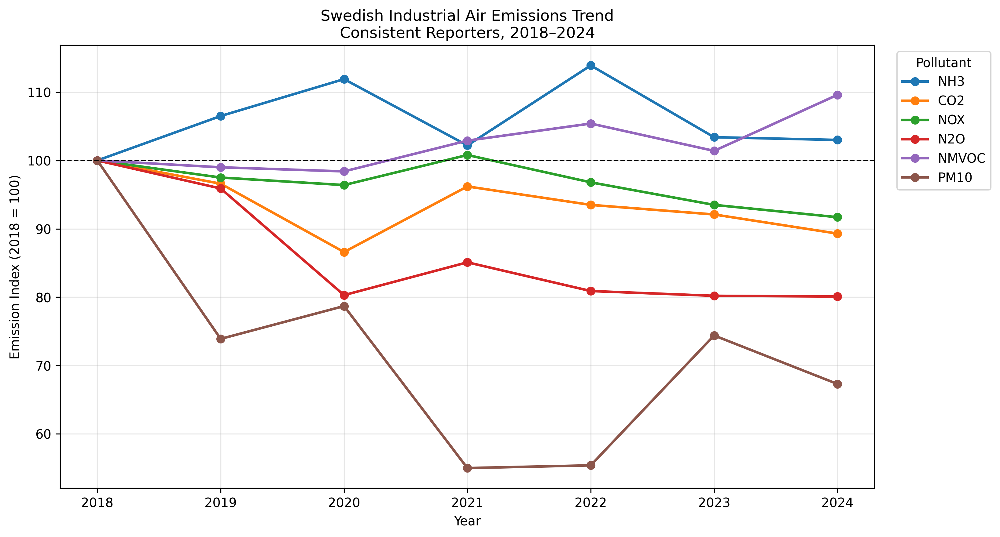
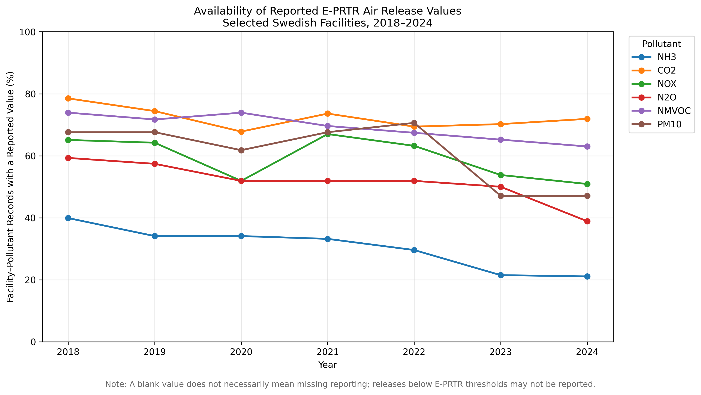
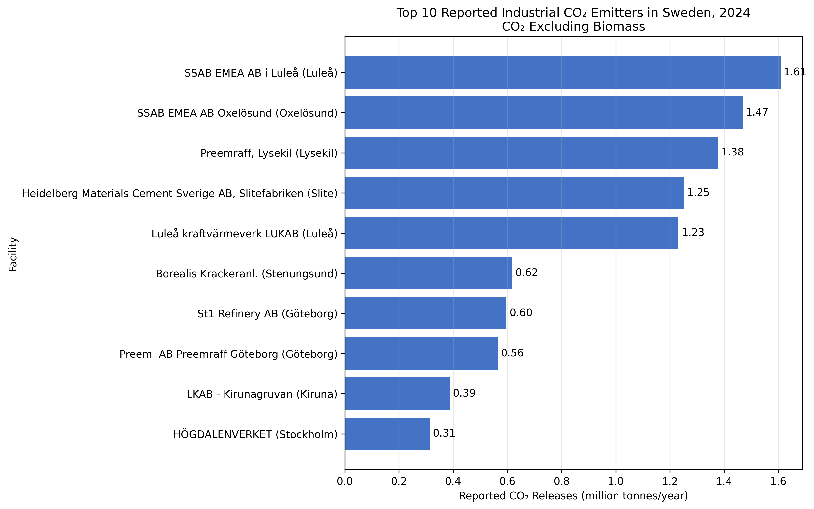
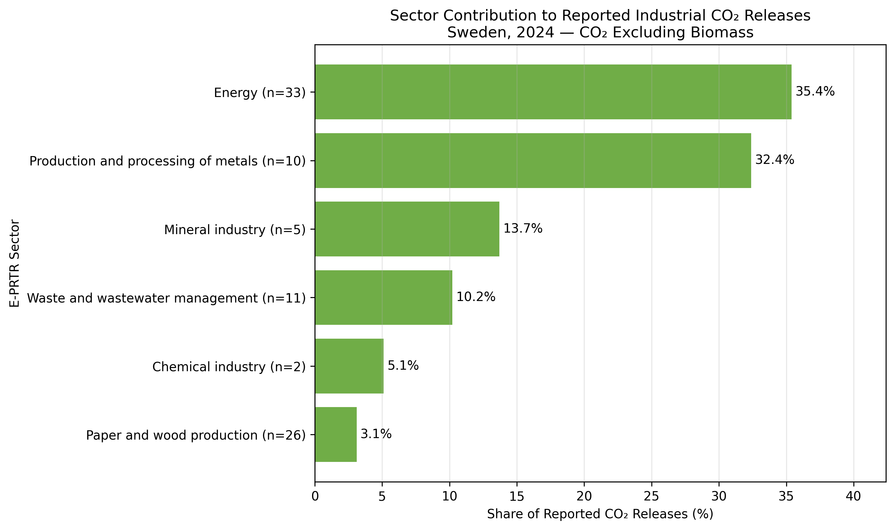

# Swedish Industrial Air Emissions Analysis

A Python-based analysis of reported industrial air releases in Sweden
using the European Environment Agency (EEA) Industrial Emissions
Dataset.

The project examines reported releases from 2018 to 2024, evaluates
annual data availability, constructs a consistent reporter panel,
identifies major CO2-emitting facilities, and analyses sector-level
contributions.

## Key Findings

Among facilities with reported values in every year from 2018 to 2024:

- CO2 excluding biomass decreased by 10.7%.
- Nitrogen oxides (NOX) decreased by 8.3%.
- Nitrous oxide (N2O) decreased by 19.9%.
- Particulate matter (PM10) decreased by 32.7%.
- Ammonia (NH3) increased by 3.0%.
- NMVOC increased by 9.6%.

Additional 2024 findings:

- Swedish facilities reported approximately 14.15 million tonnes of
  CO2 excluding biomass.
- The largest facility accounted for 11.4% of reported CO2 releases.
- The top five facilities accounted for 49.1%.
- The top ten facilities accounted for 66.6%.
- Energy, metals, and mineral industries together accounted for 81.5%
  of reported industrial CO2 releases.

## Visual Results

### Emission trends for consistent reporters

### Availability of annual reported values

### Top ten CO2-emitting facilities

### CO2 releases by E-PRTR sector

## Interactive Map

The interactive Plotly map supports zooming, industry filtering, and
facility-level hover information:

[Open the interactive facility map](outputs/interactive/sweden_co2_facilities_2024.html)

## Data Source

European Environment Agency:

Industrial Reporting under the Industrial Emissions Directive and the
European Pollutant Release and Transfer Register.

- Analysis period: 2018-2024
- Pollutant release unit: kg/year
- Geographic scope: Sweden

Official dataset:

https://www.eea.europa.eu/en/datahub/datahubitem-view/9405f714-8015-4b5b-a63c-280b82861b3d

## Methodology

1. Loaded facility-level E-PRTR air release data from Excel.
2. Filtered records for Sweden.
3. Reshaped annual columns from wide to long format.
4. Selected six climate and air-pollution indicators.
5. Assessed the availability of annual reported values.
6. Created a panel of facilities with values in all seven years.
7. Calculated emission indices using 2018 as the baseline.
8. Ranked facilities reporting CO2 releases in 2024.
9. Aggregated CO2 releases by E-PRTR sector.
10. Created static and interactive visualisations.

## Limitations

E-PRTR operators report pollutant releases when applicable annual
thresholds are exceeded. A blank value does not necessarily represent
missing or non-compliant reporting; it may indicate that the release
was below the reporting threshold.

The consistent reporter analysis improves comparability across years,
but focuses on facilities with reported values in every year. These
facilities are more likely to be persistent large emitters, so the
results should not be interpreted as representing every industrial
facility in Sweden.

The PM10 consistent sample contains only 11 facilities, so its trend
should be interpreted as exploratory.

## Output Tables

The `outputs/tables` directory contains:

- `annual_emission_trends.csv`
- `trend_summary_2018_2024.csv`
- `reported_value_availability.csv`
- `top10_co2_facilities_2024.csv`
- `co2_sector_summary_2024.csv`

## Tools

- Python
- pandas
- openpyxl
- Matplotlib
- Plotly
- Jupyter Notebook

## How to Run

1. Download the EEA Excel dataset.
2. Place it in the project directory.
3. Install the packages listed in `requirements.txt`.
4. Open and run `01_data_exploration.ipynb`.

Install the dependencies with:

`pip install -r requirements.txt`

## Author

Xi Chen
